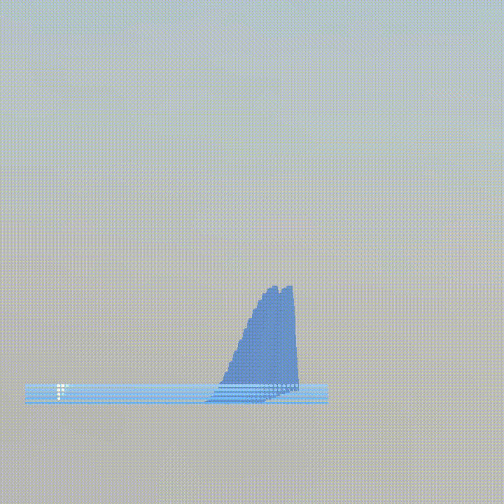

# CoupledWaterAnimation
A project to showcase Water Animation using Coupled SPH and Wave Equations

### Dev Progress
* February 2nd 2023 - Independant Functioning
The wave surface and SPH are functional independantly. There is no coupling yet.

* February 20th 2023 - Coupled SPH-Wave
The wave surface and SPH are coupled and funcitoning. Foam, splashes, and breaking waves can be seen.

* February 21st 2023 - Skybox Environment
Added a skybox and environment mapped the wave surface. There is lighting, reflection, and refraction.

* February 22nd 2023 - Camera Views
Added orthographic camera view and ImGui toggle to switch between camera views. Perspective view is meant to
showcase splashes, and foam whereas, orthographic view is meant to showcase breaking waves.

 